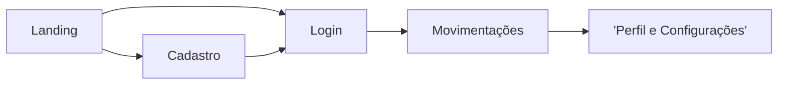

# ContaMente

frontend do projeto de finanças pessoais ([api](https://github.com/Ramon-Mateus/ContaMente-API))

## Sitemap

## Libs

- [Primeng](https://primeng.org/) - Ícones e componentes
- [ngx-env/builder](https://www.npmjs.com/package/@ngx-env/builder) - Gerenciamento de variáveis de ambiente

- preview do código: https://github1s.com/ramon-Mateus/contamente

## Como rodar

Primeiro, estando no diretório raiz, instale os pacotes relacionados ao projeto:

    npm install

depois crie um arquivo .env e dentro insira a porta que o dotnet está usando no seu computador e o protocolo (http ou https):

    NG_APP_PORTA_DA_API=????
    NG_APP_PROTOCOLO=????

Depois é só rodar:

    npm run ng serve
